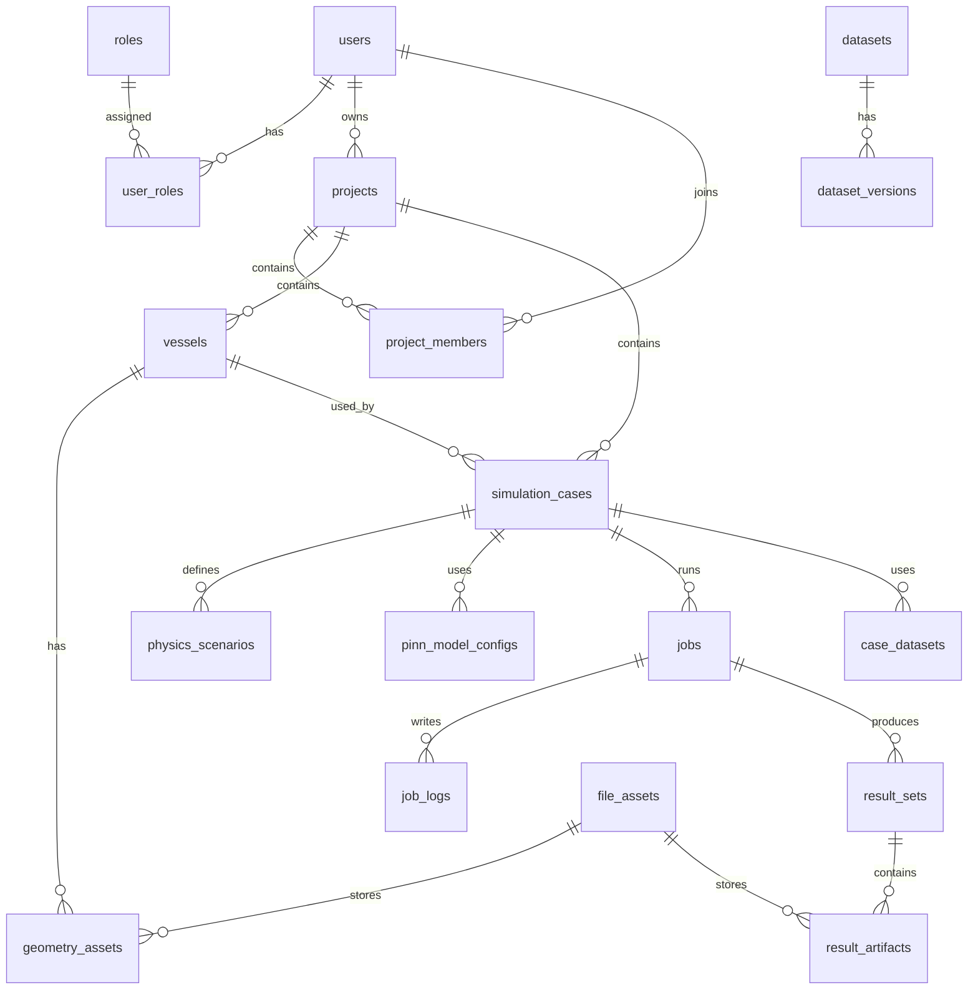

# 数据库表设计

## 1. 数据库设计原则

- 使用 PostgreSQL 作为主数据库。
- 使用 UUID 作为主要业务主键，便于分布式扩展和外部引用。
- 使用 `jsonb` 保存灵活配置，例如 PhysicsNeMo 配置、边界条件细节、可视化参数。
- 关键对象保留 `created_at`、`updated_at`、`created_by`、`status` 字段。
- 大文件不直接进入数据库，通过 `file_assets` 表保存 URI、哈希和元数据。
- 当前版本以 `jobs` 表作为后台任务主状态源，Worker 直接从数据库领取待执行任务。
- 训练、推理和后处理任务必须保存配置快照，避免历史结果随当前配置变化。
- 删除策略优先使用软删除或归档，科研数据避免误删。

## 2. 核心实体关系概览

## 3. 通用字段约定

| 字段 | 类型 | 说明 |
| --- | --- | --- |
| `id` | uuid | 主键 |
| `created_at` | timestamptz | 创建时间 |
| `updated_at` | timestamptz | 更新时间 |
| `created_by` | uuid | 创建用户 ID |
| `status` | varchar(32) | 状态枚举 |
| `metadata` | jsonb | 扩展元数据 |

## 4. 用户与权限表

### 4.1 `users`

| 字段 | 类型 | 约束 | 说明 |
| --- | --- | --- | --- |
| `id` | uuid | PK | 用户 ID |
| `username` | varchar(64) | unique, not null | 用户名 |
| `email` | varchar(255) | unique, not null | 邮箱 |
| `password_hash` | varchar(255) | not null | 密码哈希 |
| `display_name` | varchar(128) | not null | 显示名 |
| `status` | varchar(32) | not null | ACTIVE、DISABLED、DELETED |
| `last_login_at` | timestamptz | nullable | 最近登录时间 |
| `created_at` | timestamptz | not null | 创建时间 |
| `updated_at` | timestamptz | not null | 更新时间 |

索引：

- `idx_users_email`
- `idx_users_username`
- `idx_users_status`

### 4.2 `roles`

| 字段 | 类型 | 约束 | 说明 |
| --- | --- | --- | --- |
| `id` | uuid | PK | 角色 ID |
| `code` | varchar(64) | unique, not null | ADMIN、RESEARCHER、DESIGNER、VIEWER |
| `name` | varchar(128) | not null | 角色名称 |
| `description` | text | nullable | 描述 |
| `created_at` | timestamptz | not null | 创建时间 |

### 4.3 `user_roles`

| 字段 | 类型 | 约束 | 说明 |
| --- | --- | --- | --- |
| `id` | uuid | PK | 记录 ID |
| `user_id` | uuid | FK users.id, not null | 用户 ID |
| `role_id` | uuid | FK roles.id, not null | 角色 ID |
| `created_at` | timestamptz | not null | 创建时间 |

唯一约束：`uk_user_roles_user_role(user_id, role_id)`。

### 4.4 `project_members`

| 字段 | 类型 | 约束 | 说明 |
| --- | --- | --- | --- |
| `id` | uuid | PK | 成员关系 ID |
| `project_id` | uuid | FK projects.id, not null | 项目 ID |
| `user_id` | uuid | FK users.id, not null | 用户 ID |
| `permission` | varchar(32) | not null | OWNER、MANAGER、EDITOR、RUNNER、VIEWER |
| `created_at` | timestamptz | not null | 加入时间 |
| `created_by` | uuid | FK users.id | 邀请人 |

唯一约束：`uk_project_members_project_user(project_id, user_id)`。

## 5. 项目与船型表

### 5.1 `projects`

| 字段 | 类型 | 约束 | 说明 |
| --- | --- | --- | --- |
| `id` | uuid | PK | 项目 ID |
| `name` | varchar(128) | not null | 项目名称 |
| `description` | text | nullable | 项目描述 |
| `owner_id` | uuid | FK users.id, not null | 项目负责人 |
| `visibility` | varchar(32) | not null | PRIVATE、TEAM、PUBLIC_READONLY |
| `status` | varchar(32) | not null | ACTIVE、ARCHIVED、DELETED |
| `tags` | jsonb | nullable | 标签列表 |
| `created_at` | timestamptz | not null | 创建时间 |
| `updated_at` | timestamptz | not null | 更新时间 |

索引：

- `idx_projects_owner_id`
- `idx_projects_status`
- `idx_projects_created_at`

### 5.2 `vessels`

| 字段 | 类型 | 约束 | 说明 |
| --- | --- | --- | --- |
| `id` | uuid | PK | 船型 ID |
| `project_id` | uuid | FK projects.id, not null | 项目 ID |
| `name` | varchar(128) | not null | 船型名称 |
| `vessel_type` | varchar(64) | nullable | 船型类别 |
| `length_overall` | numeric(12,4) | nullable | 总长 |
| `length_waterline` | numeric(12,4) | nullable | 水线长 |
| `beam` | numeric(12,4) | nullable | 型宽 |
| `draft` | numeric(12,4) | nullable | 吃水 |
| `displacement` | numeric(14,4) | nullable | 排水量 |
| `block_coefficient` | numeric(8,5) | nullable | 方形系数 |
| `prismatic_coefficient` | numeric(8,5) | nullable | 棱形系数 |
| `wetted_surface_area` | numeric(14,4) | nullable | 湿表面积 |
| `principal_units` | varchar(32) | not null | SI、CUSTOM |
| `description` | text | nullable | 描述 |
| `status` | varchar(32) | not null | ACTIVE、ARCHIVED、DELETED |
| `created_at` | timestamptz | not null | 创建时间 |
| `updated_at` | timestamptz | not null | 更新时间 |

索引：`idx_vessels_project_id`。

## 6. 文件与几何表

### 6.1 `file_assets`

| 字段 | 类型 | 约束 | 说明 |
| --- | --- | --- | --- |
| `id` | uuid | PK | 文件 ID |
| `bucket` | varchar(128) | not null | 存储桶或目录 |
| `object_key` | varchar(512) | not null | 对象路径 |
| `original_filename` | varchar(255) | not null | 原始文件名 |
| `content_type` | varchar(128) | nullable | MIME 类型 |
| `file_ext` | varchar(32) | nullable | 扩展名 |
| `size_bytes` | bigint | not null | 文件大小 |
| `sha256` | varchar(64) | not null | 文件哈希 |
| `storage_backend` | varchar(32) | not null | LOCAL、S3、MINIO |
| `created_by` | uuid | FK users.id | 上传人 |
| `created_at` | timestamptz | not null | 上传时间 |
| `metadata` | jsonb | nullable | 文件元数据 |

索引：

- `idx_file_assets_sha256`
- `idx_file_assets_object_key`

### 6.2 `geometry_assets`

| 字段 | 类型 | 约束 | 说明 |
| --- | --- | --- | --- |
| `id` | uuid | PK | 几何资产 ID |
| `vessel_id` | uuid | FK vessels.id, not null | 船型 ID |
| `file_asset_id` | uuid | FK file_assets.id, nullable | 文件 ID |
| `name` | varchar(128) | not null | 几何名称 |
| `geometry_type` | varchar(64) | not null | STL_MESH、OBJ_MESH、SECTION_POINTS、PARAMETRIC_JSON |
| `version` | integer | not null | 版本号 |
| `scale_factor` | numeric(12,6) | default 1 | 缩放因子 |
| `coordinate_system` | varchar(64) | nullable | 坐标系说明 |
| `bbox` | jsonb | nullable | 包围盒 |
| `preprocess_status` | varchar(32) | not null | PENDING、PROCESSING、READY、FAILED |
| `preprocess_log` | text | nullable | 预处理日志 |
| `status` | varchar(32) | not null | ACTIVE、ARCHIVED、DELETED |
| `created_at` | timestamptz | not null | 创建时间 |
| `updated_at` | timestamptz | not null | 更新时间 |

索引：

- `idx_geometry_assets_vessel_id`
- `idx_geometry_assets_type`

## 7. 仿真算例表

### 7.1 `simulation_cases`

| 字段 | 类型 | 约束 | 说明 |
| --- | --- | --- | --- |
| `id` | uuid | PK | 算例 ID |
| `project_id` | uuid | FK projects.id, not null | 项目 ID |
| `vessel_id` | uuid | FK vessels.id, nullable | 船型 ID |
| `geometry_asset_id` | uuid | FK geometry_assets.id, nullable | 几何资产 ID |
| `name` | varchar(128) | not null | 算例名称 |
| `case_type` | varchar(64) | not null | CALM_WATER_RESISTANCE 等 |
| `description` | text | nullable | 描述 |
| `status` | varchar(32) | not null | DRAFT、READY、RUNNING、COMPLETED、FAILED、ARCHIVED |
| `base_case_id` | uuid | FK simulation_cases.id, nullable | 复制来源 |
| `tags` | jsonb | nullable | 标签 |
| `created_by` | uuid | FK users.id | 创建人 |
| `created_at` | timestamptz | not null | 创建时间 |
| `updated_at` | timestamptz | not null | 更新时间 |

索引：

- `idx_simulation_cases_project_id`
- `idx_simulation_cases_vessel_id`
- `idx_simulation_cases_case_type`
- `idx_simulation_cases_status`

### 7.2 `fluid_conditions`

| 字段 | 类型 | 约束 | 说明 |
| --- | --- | --- | --- |
| `id` | uuid | PK | 流体条件 ID |
| `case_id` | uuid | FK simulation_cases.id, not null | 算例 ID |
| `density` | numeric(12,6) | not null | 密度 kg/m3 |
| `kinematic_viscosity` | numeric(14,10) | nullable | 运动黏度 m2/s |
| `dynamic_viscosity` | numeric(14,10) | nullable | 动力黏度 Pa s |
| `gravity` | numeric(10,6) | default 9.80665 | 重力加速度 |
| `inlet_velocity` | numeric(12,6) | nullable | 来流速度 |
| `water_depth` | numeric(12,6) | nullable | 水深 |
| `temperature` | numeric(8,3) | nullable | 温度 |
| `reynolds_number` | numeric(20,6) | nullable | Reynolds 数 |
| `froude_number` | numeric(12,6) | nullable | Froude 数 |
| `extra_params` | jsonb | nullable | 额外物理参数 |
| `created_at` | timestamptz | not null | 创建时间 |
| `updated_at` | timestamptz | not null | 更新时间 |

唯一约束：`uk_fluid_conditions_case(case_id)`。

### 7.3 `boundary_conditions`

| 字段 | 类型 | 约束 | 说明 |
| --- | --- | --- | --- |
| `id` | uuid | PK | 边界条件 ID |
| `case_id` | uuid | FK simulation_cases.id, not null | 算例 ID |
| `name` | varchar(128) | not null | 边界名称 |
| `boundary_type` | varchar(64) | not null | INLET、OUTLET、WALL、FREE_SURFACE、SYMMETRY、FAR_FIELD |
| `target_region` | varchar(128) | nullable | 对应几何区域或采样区域 |
| `condition_expr` | jsonb | not null | 条件表达式和值 |
| `loss_weight` | numeric(12,6) | default 1 | 损失权重 |
| `sampling_config` | jsonb | nullable | 边界采样策略 |
| `created_at` | timestamptz | not null | 创建时间 |
| `updated_at` | timestamptz | not null | 更新时间 |

索引：`idx_boundary_conditions_case_id`。

### 7.4 `physics_scenarios`

| 字段 | 类型 | 约束 | 说明 |
| --- | --- | --- | --- |
| `id` | uuid | PK | 物理场景 ID |
| `case_id` | uuid | FK simulation_cases.id, not null | 算例 ID |
| `equation_template` | varchar(128) | not null | 控制方程模板 |
| `dimension` | integer | not null | 2 或 3 |
| `time_mode` | varchar(32) | not null | STEADY、UNSTEADY |
| `domain_config` | jsonb | not null | 计算域配置 |
| `initial_conditions` | jsonb | nullable | 初始条件 |
| `pde_loss_config` | jsonb | not null | PDE 残差与权重配置 |
| `sampling_config` | jsonb | not null | 域内采样策略 |
| `assumptions` | text | nullable | 物理假设说明 |
| `created_at` | timestamptz | not null | 创建时间 |
| `updated_at` | timestamptz | not null | 更新时间 |

唯一约束：`uk_physics_scenarios_case(case_id)`。

### 7.5 `case_snapshots`

| 字段 | 类型 | 约束 | 说明 |
| --- | --- | --- | --- |
| `id` | uuid | PK | 快照 ID |
| `case_id` | uuid | FK simulation_cases.id, not null | 算例 ID |
| `snapshot_type` | varchar(32) | not null | TRAINING、INFERENCE、REPORT |
| `snapshot_json` | jsonb | not null | 完整配置快照 |
| `code_version` | varchar(128) | nullable | 代码版本 |
| `dependency_versions` | jsonb | nullable | 依赖版本 |
| `created_by` | uuid | FK users.id | 创建人 |
| `created_at` | timestamptz | not null | 创建时间 |

索引：`idx_case_snapshots_case_id`。

## 8. PINN 模型表

### 8.1 `pinn_model_configs`

| 字段 | 类型 | 约束 | 说明 |
| --- | --- | --- | --- |
| `id` | uuid | PK | 模型配置 ID |
| `case_id` | uuid | FK simulation_cases.id, not null | 算例 ID |
| `name` | varchar(128) | not null | 配置名称 |
| `network_type` | varchar(64) | not null | MLP、FOURIER_MLP、SIREN |
| `input_variables` | jsonb | not null | 输入变量列表 |
| `output_variables` | jsonb | not null | 输出变量列表 |
| `network_config` | jsonb | not null | 网络结构参数 |
| `optimizer_config` | jsonb | not null | 优化器配置 |
| `training_config` | jsonb | not null | 训练参数 |
| `sampling_config` | jsonb | nullable | 采样策略 |
| `physicsnemo_config` | jsonb | nullable | PhysicsNeMo 低层配置 |
| `version` | integer | not null | 版本号 |
| `status` | varchar(32) | not null | DRAFT、READY、DEPRECATED |
| `created_by` | uuid | FK users.id | 创建人 |
| `created_at` | timestamptz | not null | 创建时间 |
| `updated_at` | timestamptz | not null | 更新时间 |

索引：

- `idx_pinn_model_configs_case_id`
- `idx_pinn_model_configs_status`

### 8.2 `loss_terms`

| 字段 | 类型 | 约束 | 说明 |
| --- | --- | --- | --- |
| `id` | uuid | PK | 损失项 ID |
| `model_config_id` | uuid | FK pinn_model_configs.id, not null | 模型配置 ID |
| `name` | varchar(128) | not null | 损失项名称 |
| `term_type` | varchar(64) | not null | PDE、BOUNDARY、INITIAL、DATA、REGULARIZATION |
| `expression` | jsonb | nullable | 表达式或引用 |
| `weight` | numeric(14,8) | not null | 权重 |
| `enabled` | boolean | default true | 是否启用 |
| `schedule` | jsonb | nullable | 权重调度策略 |
| `created_at` | timestamptz | not null | 创建时间 |

索引：`idx_loss_terms_model_config_id`。

### 8.3 `model_checkpoints`

| 字段 | 类型 | 约束 | 说明 |
| --- | --- | --- | --- |
| `id` | uuid | PK | 检查点 ID |
| `model_config_id` | uuid | FK pinn_model_configs.id, not null | 模型配置 ID |
| `training_job_id` | uuid | FK training_jobs.id, not null | 训练任务 ID |
| `file_asset_id` | uuid | FK file_assets.id, not null | 检查点文件 |
| `epoch` | integer | nullable | Epoch |
| `iteration` | integer | nullable | 迭代步 |
| `total_loss` | numeric(20,10) | nullable | 总损失 |
| `metric_summary` | jsonb | nullable | 指标摘要 |
| `is_best` | boolean | default false | 是否最佳 |
| `status` | varchar(32) | not null | ACTIVE、DEPRECATED、DELETED |
| `created_at` | timestamptz | not null | 创建时间 |

索引：

- `idx_model_checkpoints_model_config_id`
- `idx_model_checkpoints_training_job_id`

## 9. 任务表

当前版本不引入 Redis 队列。后台 Worker 按状态和优先级从 `jobs` 表领取任务并更新执行结果。

### 9.1 `jobs`

| 字段 | 类型 | 约束 | 说明 |
| --- | --- | --- | --- |
| `id` | uuid | PK | 通用任务 ID |
| `project_id` | uuid | FK projects.id, not null | 项目 ID |
| `case_id` | uuid | FK simulation_cases.id, nullable | 算例 ID |
| `job_type` | varchar(64) | not null | TRAINING、INFERENCE、POSTPROCESS、REPORT、GEOMETRY_PREPROCESS |
| `status` | varchar(32) | not null | PENDING、RUNNING、SUCCEEDED、FAILED、CANCELED |
| `priority` | integer | default 100 | 优先级，数值越小越优先 |
| `progress` | numeric(5,2) | default 0 | 进度百分比 |
| `resource_request` | jsonb | nullable | CPU/GPU/显存需求 |
| `config_snapshot_id` | uuid | FK case_snapshots.id, nullable | 配置快照 |
| `started_at` | timestamptz | nullable | 开始时间 |
| `finished_at` | timestamptz | nullable | 结束时间 |
| `error_code` | varchar(128) | nullable | 错误码 |
| `error_message` | text | nullable | 错误信息 |
| `created_by` | uuid | FK users.id | 创建人 |
| `created_at` | timestamptz | not null | 创建时间 |
| `updated_at` | timestamptz | not null | 更新时间 |

索引：

- `idx_jobs_project_id`
- `idx_jobs_case_id`
- `idx_jobs_status`
- `idx_jobs_type_status`

### 9.2 `training_jobs`

| 字段 | 类型 | 约束 | 说明 |
| --- | --- | --- | --- |
| `id` | uuid | PK | 训练任务 ID |
| `job_id` | uuid | FK jobs.id, unique, not null | 通用任务 ID |
| `model_config_id` | uuid | FK pinn_model_configs.id, not null | 模型配置 ID |
| `max_iterations` | integer | nullable | 最大迭代步 |
| `current_iteration` | integer | default 0 | 当前迭代步 |
| `best_loss` | numeric(20,10) | nullable | 最佳损失 |
| `final_loss` | numeric(20,10) | nullable | 最终损失 |
| `random_seed` | integer | nullable | 随机种子 |
| `runtime_env` | jsonb | nullable | 运行环境 |
| `created_at` | timestamptz | not null | 创建时间 |
| `updated_at` | timestamptz | not null | 更新时间 |

### 9.3 `simulation_jobs`

| 字段 | 类型 | 约束 | 说明 |
| --- | --- | --- | --- |
| `id` | uuid | PK | 推理/仿真任务 ID |
| `job_id` | uuid | FK jobs.id, unique, not null | 通用任务 ID |
| `checkpoint_id` | uuid | FK model_checkpoints.id, nullable | 使用的检查点 |
| `inference_config` | jsonb | not null | 采样和推理配置 |
| `postprocess_config` | jsonb | nullable | 后处理配置 |
| `created_at` | timestamptz | not null | 创建时间 |
| `updated_at` | timestamptz | not null | 更新时间 |

### 9.4 `job_logs`

| 字段 | 类型 | 约束 | 说明 |
| --- | --- | --- | --- |
| `id` | uuid | PK | 日志 ID |
| `job_id` | uuid | FK jobs.id, not null | 任务 ID |
| `level` | varchar(16) | not null | DEBUG、INFO、WARN、ERROR |
| `message` | text | not null | 日志内容 |
| `payload` | jsonb | nullable | 结构化日志 |
| `created_at` | timestamptz | not null | 日志时间 |

索引：`idx_job_logs_job_id_created_at`。

### 9.5 `job_events`

| 字段 | 类型 | 约束 | 说明 |
| --- | --- | --- | --- |
| `id` | uuid | PK | 事件 ID |
| `job_id` | uuid | FK jobs.id, not null | 任务 ID |
| `event_type` | varchar(64) | not null | CREATED、STARTED、PROGRESS、SUCCEEDED、FAILED、CANCELED |
| `from_status` | varchar(32) | nullable | 原状态 |
| `to_status` | varchar(32) | nullable | 新状态 |
| `payload` | jsonb | nullable | 事件数据 |
| `created_at` | timestamptz | not null | 事件时间 |

索引：`idx_job_events_job_id_created_at`。

## 10. 数据集表

### 10.1 `datasets`

| 字段 | 类型 | 约束 | 说明 |
| --- | --- | --- | --- |
| `id` | uuid | PK | 数据集 ID |
| `project_id` | uuid | FK projects.id, not null | 项目 ID |
| `name` | varchar(128) | not null | 数据集名称 |
| `dataset_type` | varchar(64) | not null | EXPERIMENT、CFD、SENSOR、BENCHMARK |
| `description` | text | nullable | 描述 |
| `source` | varchar(255) | nullable | 数据来源 |
| `unit_system` | varchar(32) | not null | SI、CUSTOM |
| `status` | varchar(32) | not null | ACTIVE、ARCHIVED、DELETED |
| `created_by` | uuid | FK users.id | 创建人 |
| `created_at` | timestamptz | not null | 创建时间 |
| `updated_at` | timestamptz | not null | 更新时间 |

### 10.2 `dataset_versions`

| 字段 | 类型 | 约束 | 说明 |
| --- | --- | --- | --- |
| `id` | uuid | PK | 数据集版本 ID |
| `dataset_id` | uuid | FK datasets.id, not null | 数据集 ID |
| `version` | integer | not null | 版本号 |
| `file_asset_id` | uuid | FK file_assets.id, not null | 数据文件 |
| `schema_json` | jsonb | nullable | 字段结构 |
| `quality_report` | jsonb | nullable | 质量检查结果 |
| `status` | varchar(32) | not null | READY、FAILED、DEPRECATED |
| `created_at` | timestamptz | not null | 创建时间 |

唯一约束：`uk_dataset_versions_dataset_version(dataset_id, version)`。

### 10.3 `case_datasets`

| 字段 | 类型 | 约束 | 说明 |
| --- | --- | --- | --- |
| `id` | uuid | PK | 关联 ID |
| `case_id` | uuid | FK simulation_cases.id, not null | 算例 ID |
| `dataset_version_id` | uuid | FK dataset_versions.id, not null | 数据集版本 ID |
| `usage_type` | varchar(64) | not null | TRAINING_LOSS、VALIDATION、REFERENCE、COMPARISON |
| `mapping_config` | jsonb | nullable | 字段映射 |
| `created_at` | timestamptz | not null | 创建时间 |

唯一约束：`uk_case_datasets_case_dataset(case_id, dataset_version_id, usage_type)`。

## 11. 结果与报告表

### 11.1 `result_sets`

| 字段 | 类型 | 约束 | 说明 |
| --- | --- | --- | --- |
| `id` | uuid | PK | 结果集 ID |
| `project_id` | uuid | FK projects.id, not null | 项目 ID |
| `case_id` | uuid | FK simulation_cases.id, not null | 算例 ID |
| `job_id` | uuid | FK jobs.id, nullable | 产生结果的任务 |
| `checkpoint_id` | uuid | FK model_checkpoints.id, nullable | 对应模型检查点 |
| `name` | varchar(128) | not null | 结果集名称 |
| `result_type` | varchar(64) | not null | TRAINING、INFERENCE、POSTPROCESS、COMPARISON |
| `metric_summary` | jsonb | nullable | 指标摘要 |
| `status` | varchar(32) | not null | ACTIVE、ARCHIVED、DELETED |
| `created_at` | timestamptz | not null | 创建时间 |
| `updated_at` | timestamptz | not null | 更新时间 |

索引：

- `idx_result_sets_case_id`
- `idx_result_sets_job_id`

### 11.2 `result_artifacts`

| 字段 | 类型 | 约束 | 说明 |
| --- | --- | --- | --- |
| `id` | uuid | PK | 结果工件 ID |
| `result_set_id` | uuid | FK result_sets.id, not null | 结果集 ID |
| `file_asset_id` | uuid | FK file_assets.id, nullable | 文件 ID |
| `artifact_type` | varchar(64) | not null | SCALAR_METRIC、CURVE、FIELD_2D、FIELD_3D、IMAGE、REPORT |
| `name` | varchar(128) | not null | 工件名称 |
| `data_json` | jsonb | nullable | 小型结构化结果 |
| `visualization_config` | jsonb | nullable | 前端可视化配置 |
| `created_at` | timestamptz | not null | 创建时间 |

索引：`idx_result_artifacts_result_set_id`。

### 11.3 `reports`

| 字段 | 类型 | 约束 | 说明 |
| --- | --- | --- | --- |
| `id` | uuid | PK | 报告 ID |
| `project_id` | uuid | FK projects.id, not null | 项目 ID |
| `case_id` | uuid | FK simulation_cases.id, nullable | 算例 ID |
| `result_set_id` | uuid | FK result_sets.id, nullable | 结果集 ID |
| `title` | varchar(255) | not null | 报告标题 |
| `template_code` | varchar(128) | nullable | 模板编号 |
| `file_asset_id` | uuid | FK file_assets.id, nullable | 报告文件 |
| `status` | varchar(32) | not null | DRAFT、GENERATING、READY、FAILED、ARCHIVED |
| `created_by` | uuid | FK users.id | 创建人 |
| `created_at` | timestamptz | not null | 创建时间 |
| `updated_at` | timestamptz | not null | 更新时间 |

## 12. 审计与系统表

### 12.1 `audit_logs`

| 字段 | 类型 | 约束 | 说明 |
| --- | --- | --- | --- |
| `id` | uuid | PK | 审计 ID |
| `actor_id` | uuid | FK users.id, nullable | 操作人 |
| `action` | varchar(128) | not null | 操作类型 |
| `entity_type` | varchar(128) | not null | 对象类型 |
| `entity_id` | uuid | nullable | 对象 ID |
| `project_id` | uuid | FK projects.id, nullable | 项目 ID |
| `before_json` | jsonb | nullable | 修改前 |
| `after_json` | jsonb | nullable | 修改后 |
| `ip_address` | inet | nullable | IP 地址 |
| `user_agent` | text | nullable | User Agent |
| `created_at` | timestamptz | not null | 操作时间 |

索引：

- `idx_audit_logs_actor_id`
- `idx_audit_logs_entity`
- `idx_audit_logs_project_id_created_at`

### 12.2 `system_settings`

| 字段 | 类型 | 约束 | 说明 |
| --- | --- | --- | --- |
| `id` | uuid | PK | 配置 ID |
| `key` | varchar(128) | unique, not null | 配置键 |
| `value_json` | jsonb | not null | 配置值 |
| `description` | text | nullable | 描述 |
| `updated_by` | uuid | FK users.id | 更新人 |
| `updated_at` | timestamptz | not null | 更新时间 |

### 12.3 `notifications`

| 字段 | 类型 | 约束 | 说明 |
| --- | --- | --- | --- |
| `id` | uuid | PK | 通知 ID |
| `user_id` | uuid | FK users.id, not null | 用户 ID |
| `title` | varchar(255) | not null | 标题 |
| `message` | text | not null | 内容 |
| `notification_type` | varchar(64) | not null | JOB、SYSTEM、PROJECT |
| `read_at` | timestamptz | nullable | 已读时间 |
| `payload` | jsonb | nullable | 附加数据 |
| `created_at` | timestamptz | not null | 创建时间 |

## 13. 枚举建议

| 枚举 | 取值 |
| --- | --- |
| `job_status` | PENDING、RUNNING、SUCCEEDED、FAILED、CANCELED |
| `case_status` | DRAFT、READY、RUNNING、COMPLETED、FAILED、ARCHIVED |
| `case_type` | CALM_WATER_RESISTANCE、FLOW_AROUND_HULL、REGULAR_WAVE_RESPONSE、MANEUVERING_SIMPLIFIED、PARAMETER_SWEEP、DATA_ASSIMILATION |
| `artifact_type` | SCALAR_METRIC、CURVE、FIELD_2D、FIELD_3D、VECTOR_FIELD、IMAGE、REPORT |
| `permission` | OWNER、MANAGER、EDITOR、RUNNER、VIEWER |
| `geometry_type` | STL_MESH、OBJ_MESH、SECTION_POINTS、PARAMETRIC_JSON、DOMAIN_CONFIG |

## 14. 初始数据建议

- 默认管理员角色。
- 默认研究人员、设计人员、访客角色。
- 默认仿真模板：静水阻力、绕流流场、数据同化。
- 默认报告模板：单算例报告、对比报告。
- 默认系统配置：文件大小限制、任务超时、存储桶名称。

## 15. 后续详细设计事项

- 将 `jsonb` 配置字段进一步规范为 JSON Schema。
- 确认单位系统和单位转换策略。
- 定义每类结果文件格式，例如 CSV、NPY、VTK、PNG、HTML、PDF。
- 设计数据库迁移脚本。
- 设计数据保留、归档和备份策略。
- 后续版本若引入独立消息队列，再补充 Broker、任务租约和实时消息通道的数据模型。
