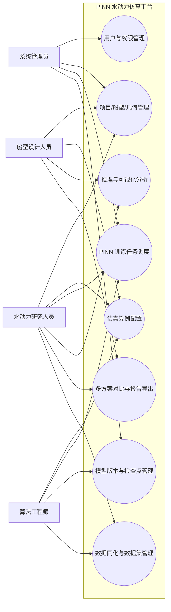
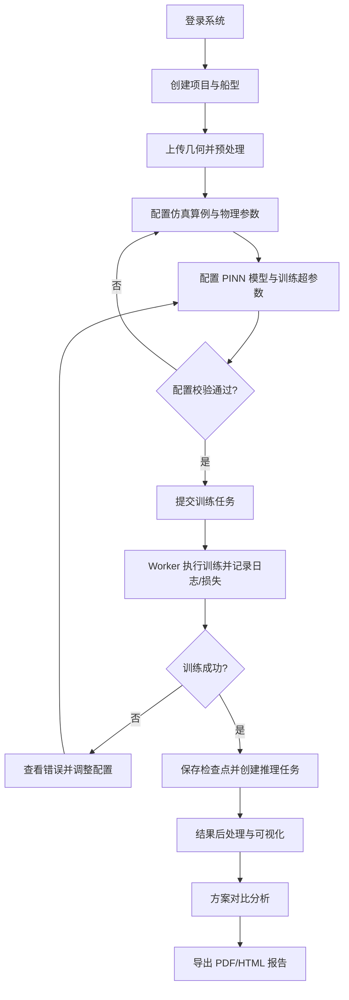
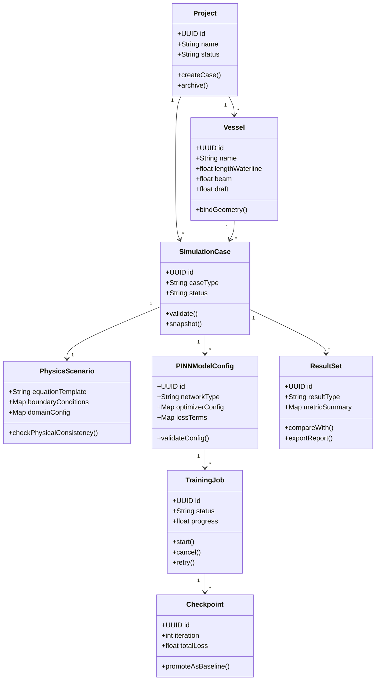
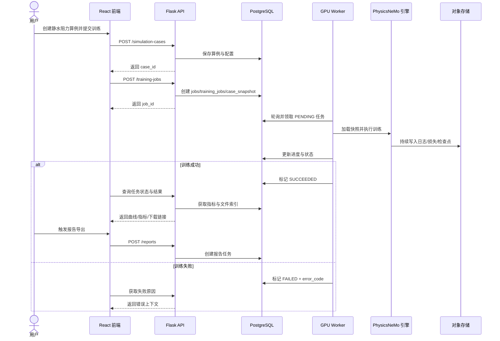
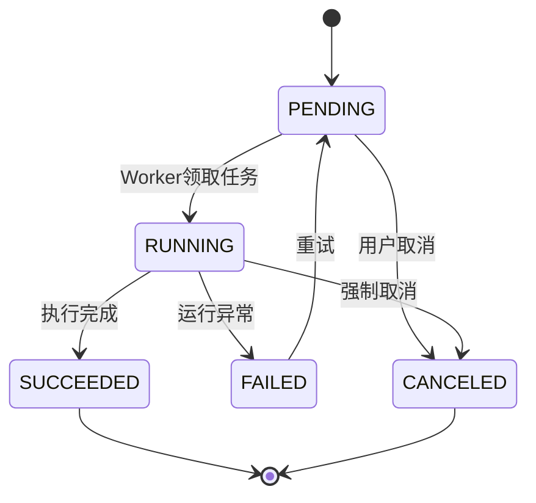
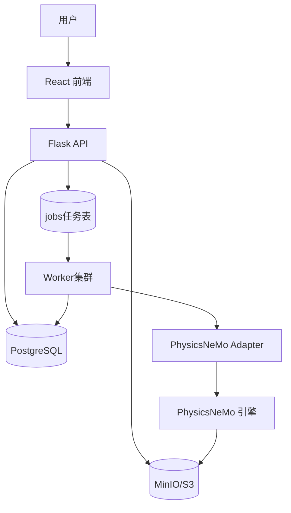
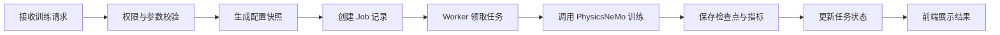
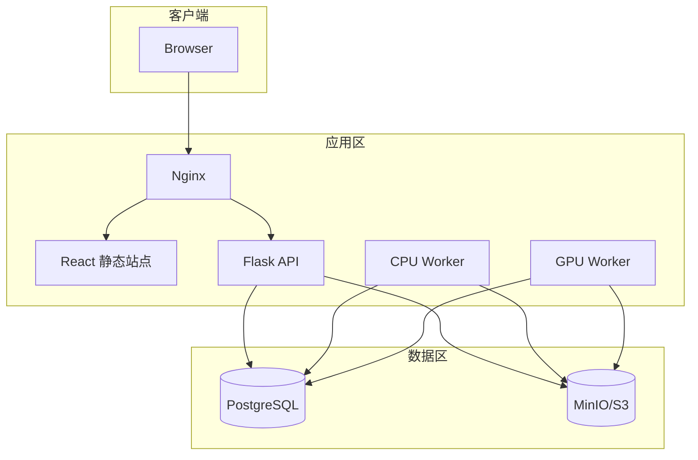
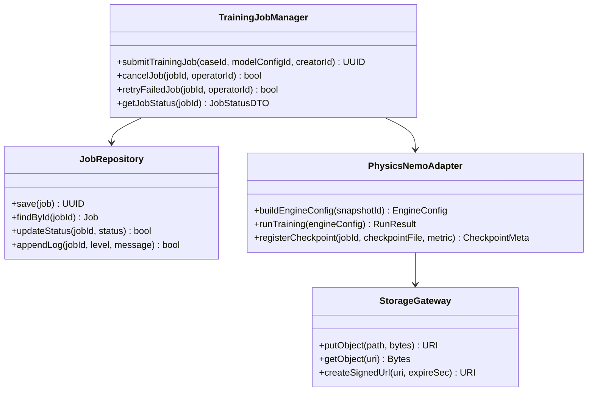
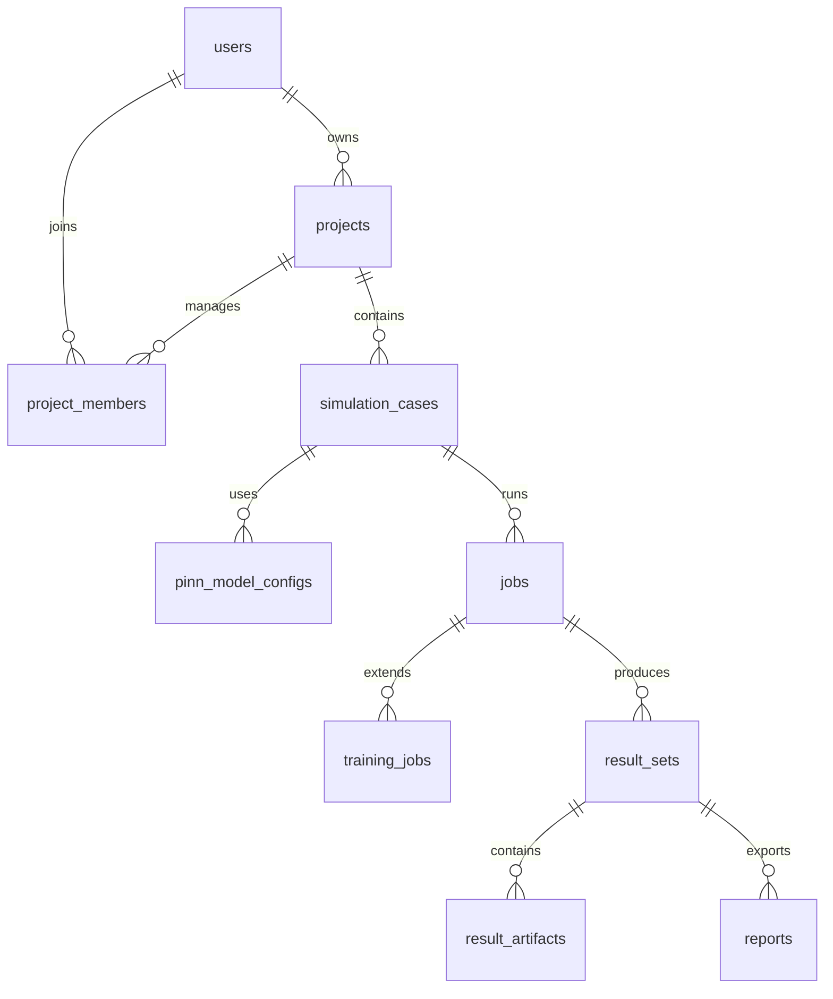

# 需求设计报告

- **项目名称：基于 PhysicsNeMo 的船舶水动力学 PINN 仿真平台**
- **学院：软件学院**
- **专业班级：待填写**
- **学号姓名（工作%）：待填写**
- **学号姓名（工作%）：待填写**
- **学号姓名（工作%）：待填写**
- **提交日期：2026-05-16**

## 需求规约更改履历

| 序号 | 版本 | 更改时间 | 更改人 | 更改章节 | 状态 | 更改描述 |
| --- | --- | --- | --- | --- | --- | --- |
| 1 | V1.0 | 2026-05-16 | 项目组 | 全文 | 新建 | 首次整合需求设计与软件设计报告 |

状态：新建、增加、修改、删除。

## 目录

- 1 引言
- 1.1 目的
- 1.2 背景
- 1.3 参考资料
- 1.4 术语
- 2 任务概述目标
- 3 需求规定
- 3.1 一般性需求
- 3.2 功能性需求
- 用例图
- 类图
- 状态图（时序图）
- 4 运行环境规定
- 4.1 运行环境
- 4.2 接口（外部系统或设备）
- 5 项目非技术需求

---

## 1 引言

### 1.1 目的

本文档用于定义“基于 PhysicsNeMo 的船舶水动力学 PINN 仿真平台”的需求规格与设计方案，作为开发、测试、验收和课程答辩的统一依据，保证系统具备可实现性、可验证性和可复现性。

### 1.2 背景

系统服务于《软件工程导论》课程结课作业场景，面向船舶水动力研究与教学实验。平台以 Physics-Informed Neural Network（PINN）为核心算法范式，支持船型与算例配置、训练调度、仿真推理、结果可视化与报告导出。

### 1.3 参考资料

| 序号 | 资料名称 | 说明 |
| --- | --- | --- |
| 1 | NVIDIA PhysicsNeMo Documentation | PINN 建模与训练框架参考 |
| 2 | PostgreSQL Documentation | 元数据和任务状态数据存储参考 |
| 3 | React Documentation | 前端可视化与交互实现参考 |
| 4 | Flask Documentation | 后端 API 与服务编排参考 |
| 5 | 本项目 `docs/01~07` 文档 | 需求、架构、模块、数据库、流程等基础资料 |

### 1.4 术语

| 词汇名称 | 词汇含义 | 备注 |
| --- | --- | --- |
| CFD | Computational Fluid Dynamics，计算流体力学 | 传统高精度数值仿真方法 |
| PINN | Physics-Informed Neural Network，物理信息神经网络 | 将 PDE 与边界条件纳入神经网络训练 |
| PhysicsNeMo | NVIDIA 提供的科学机器学习与物理约束建模框架 | 本系统核心引擎 |
| RANS | Reynolds-Averaged Navier-Stokes，雷诺平均方程 | 湍流问题常用工程模型 |
| Checkpoint | 训练检查点，保存模型权重、优化器状态和训练元数据 | 用于恢复训练和推理复现 |
| Reynolds 数 | 表征惯性力与黏性力相对大小的无量纲参数 | 流动状态关键参数 |
| Froude 数 | 表征惯性力与重力相对大小的无量纲参数 | 船舶阻力与兴波问题关键参数 |

## 2 任务概述目标

1. 构建一个面向教学与研究的 Web 化 PINN 水动力仿真平台。
2. 支持从项目创建、算例配置、模型训练到结果展示与报告导出的完整闭环。
3. 建立任务、模型、结果与数据资产的版本化追踪机制，保障实验可复现。
4. 支持多角色协作与项目级权限控制，保证数据安全和过程可审计。

## 3 需求规定

### 3.1 一般性需求

| 编号 | 需求项 | 描述 |
| --- | --- | --- |
| GR-001 | 多角色协同 | 支持管理员、研究人员、设计人员、教学用户 |
| GR-002 | 可复现性 | 训练/推理任务必须绑定配置快照与依赖版本 |
| GR-003 | 可扩展性 | 可扩展更多物理方程、损失项和仿真场景 |
| GR-004 | 可观测性 | 记录 API、任务、训练、审计日志与资源指标 |
| GR-005 | 数据安全 | 按项目隔离访问，文件资产可追踪可校验 |

### 3.2 功能性需求

#### 3.2.1 用户与权限

| 编号 | 需求 |
| --- | --- |
| FR-001 | 支持注册、登录、登出、密码重置 |
| FR-002 | 支持角色授权：管理员、研究人员、设计人员、访客 |
| FR-003 | 支持项目级成员权限：查看、编辑、运行、管理 |
| FR-004 | 关键操作写入审计日志 |

#### 3.2.2 项目与船型管理

| 编号 | 需求 |
| --- | --- |
| FR-101 | 支持项目创建、编辑、归档、删除 |
| FR-102 | 支持船型参数维护（尺度、排水量、系数等） |
| FR-103 | 支持 STL/OBJ/CSV/JSON 等几何资产管理 |
| FR-104 | 记录文件版本、校验值、处理状态 |

#### 3.2.3 仿真算例配置

| 编号 | 需求 |
| --- | --- |
| FR-201 | 支持静水阻力、绕流流场、规则波响应、参数扫描等算例 |
| FR-202 | 支持流体参数与工况参数配置 |
| FR-203 | 支持 Reynolds/Froude 等无量纲参数配置 |
| FR-204 | 支持入口、出口、壁面、自由液面等边界条件 |
| FR-205 | 支持控制方程模板配置 |
| FR-206 | 支持算例模板复用 |

#### 3.2.4 PINN 训练与模型管理

| 编号 | 需求 |
| --- | --- |
| FR-301 | 基于 PhysicsNeMo 组织网络、约束与训练流程 |
| FR-302 | 支持 MLP/Fourier/SIREN 等网络结构配置 |
| FR-303 | 支持 PDE/边界/初始/数据损失权重配置 |
| FR-304 | 支持优化器、学习率、批大小、迭代数等超参数配置 |
| FR-305 | 支持任务提交、暂停、取消、重试、状态查询 |
| FR-306 | 保存日志、损失曲线、检查点和配置快照 |
| FR-307 | 支持模型版本标记（基线/发布/废弃） |

#### 3.2.5 推理、后处理与可视化

| 编号 | 需求 |
| --- | --- |
| FR-401 | 支持基于已训练模型执行推理 |
| FR-402 | 支持剖面线、切片、体数据和时间序列采样 |
| FR-403 | 输出速度、压力、涡量、残差、力系数等结果 |
| FR-404 | 支持曲线图、云图、矢量图、对比视图 |
| FR-405 | 支持多算例和多版本对比 |
| FR-406 | 支持 PDF/HTML 报告导出 |

#### 3.2.6 数据与实验追踪

| 编号 | 需求 |
| --- | --- |
| FR-501 | 保存仿真、训练、推理配置快照 |
| FR-502 | 支持外部观测数据上传与数据同化 |
| FR-503 | 记录数据来源、版本、字段、单位和质量检查 |
| FR-504 | 支持结果归档、标签与检索 |

### 用例图

### 业务流程图

### 类图

### 状态图（时序图）

### 状态转换图（任务）

## 4 运行环境规定

### 4.1 运行环境

#### 4.1.1 软件环境

| 类别 | 建议版本 | 说明 |
| --- | --- | --- |
| 操作系统 | Ubuntu 20.04+/Windows 11 | 开发支持 Windows，生产优先 Linux |
| Python | 3.10+ | 后端 API、Worker、PINN 适配层 |
| Flask | 2.x | REST API 与业务编排 |
| PostgreSQL | 14+ | 元数据与任务状态存储 |
| Node.js | 18+ | 前端 React 构建环境 |
| React | 18+ | 前端交互与可视化 |
| PhysicsNeMo | 与 CUDA 对齐版本 | PINN 训练与推理核心框架 |
| 对象存储 | MinIO/S3 兼容 | 几何、检查点、结果工件 |
| 容器环境 | Docker Compose（起步） | 开发部署与环境一致性 |

#### 4.1.2 硬件环境

| 资源项 | 最低建议 | 推荐 |
| --- | --- | --- |
| CPU | 8 核 | 16 核及以上 |
| 内存 | 32 GB | 64 GB |
| GPU | NVIDIA GPU（显存 ≥ 16 GB） | 显存 24 GB+ |
| 存储 | 可用空间 ≥ 200 GB | SSD 500 GB+ |
| 网络 | 千兆内网 | 支持大文件传输与备份 |

### 4.2 接口（外部系统或设备）

| 接口对象 | 接口方式 | 输入 | 输出 |
| --- | --- | --- | --- |
| PhysicsNeMo 引擎 | 适配器调用（Python API/配置文件） | 算例快照、模型配置、数据集 URI | 训练日志、检查点、指标、场数据 |
| 对象存储（MinIO/S3） | SDK/HTTP | 二进制文件流、元数据 | URI、校验值、访问链接 |
| 浏览器前端 | REST/JSON | 用户操作、配置参数、查询条件 | 任务状态、结果索引、可视化数据 |
| 外部观测数据源 | 文件导入（CSV/NPY/JSON） | 观测点坐标、物理量、单位 | 同化数据集版本与质量报告 |

## 5 项目非技术需求

| 编号 | 类型 | 需求 |
| --- | --- | --- |
| NFR-001 | 可用性 | 核心业务闭环可通过 Web 端独立完成 |
| NFR-002 | 性能 | 普通查询接口 P95 < 500ms，重任务异步化 |
| NFR-003 | 可靠性 | 任务失败可追踪、可诊断、可安全重试 |
| NFR-004 | 安全性 | 项目级权限隔离、敏感接口鉴权、操作审计 |
| NFR-005 | 可维护性 | 前后端、引擎、调度模块边界清晰 |
| NFR-006 | 可扩展性 | 新物理场景和新损失项可插拔扩展 |
| NFR-007 | 可复现性 | 固化快照、随机种子、依赖版本 |

关键指标示例（阻力系数）：

$$
C_D = \frac{2F_D}{\rho U^2 A}
$$

其中，$F_D$ 为阻力，$\rho$ 为流体密度，$U$ 为来流速度，$A$ 为参考面积。

---

# 软件设计报告

## 目录

- 1 引言
- 1.1 编制目的
- 1.2 词汇表
- 1.3 参考资料
- 2 系统开发环境
- 3 系统设计思路
- 4 功能模块设计（核心）
- 5 数据库设计

## 1 引言

### 1.1 编制目的

本报告用于描述系统整体架构、核心模块与数据库设计，达到指导开发实现、联调测试与课程验收答辩的目的。

### 1.2 词汇表

| 词汇名称 | 词汇含义 | 备注 |
| --- | --- | --- |
| Worker | 后台异步执行器 | 负责训练/推理/后处理/报告任务 |
| Result Set | 结果集 | 一次训练或推理输出的聚合结果 |
| Artifact | 结果工件 | 图像、曲线、体数据、报告等具体文件 |
| Snapshot | 配置快照 | 用于可复现实验的不可变配置记录 |
| Adapter | 适配层 | 解耦业务系统与 PhysicsNeMo 内部 API |

### 1.3 参考资料

与“需求设计报告 1.3 参考资料”一致。

## 2 系统开发环境

- 操作系统：Windows 11（开发）/Ubuntu 20.04+（部署）
- 集成开发工具：VS Code / PyCharm / WebStorm
- 编译与运行环境：Python 3.10+、Node.js 18+
- Web 服务器：Nginx（生产）
- 数据库：PostgreSQL 14+
- 训练环境：NVIDIA GPU + CUDA + PhysicsNeMo

## 3 系统设计思路

系统采用“前后端分离 + 异步任务调度 + 引擎适配层 + 元数据/文件分离存储”的分层架构，确保交互稳定、训练可扩展、数据可追踪。

### 3.1 体系结构图

### 3.2 处理流程图（训练）

### 3.3 部署图

## 4 功能模块设计（核心）

### 4.1 项目与算例管理模块

#### 4.1.1 功能说明

负责项目、船型、几何资产、仿真算例生命周期管理，提供模板化配置和配置校验能力。

#### 4.1.2 类、方法设计

##### ProjectCaseService 类

该类的功能：统一管理项目、船型与算例的创建、更新、归档和校验流程。

| 返回值 | 方法名 | 功能 | 参数说明 |
| --- | --- | --- | --- |
| `UUID` | `createProject` | 创建项目并初始化默认配置 | `ownerId: UUID, name: string, description: string` |
| `UUID` | `createSimulationCase` | 在项目下创建算例并绑定船型/几何 | `projectId: UUID, vesselId: UUID, caseType: string` |
| `ValidationResult` | `validateCase` | 校验算例物理参数、边界条件和模板完整性 | `caseId: UUID` |
| `bool` | `archiveProject` | 将项目置为归档并转只读 | `projectId: UUID, operatorId: UUID` |

#### 4.1.3 相关数据表

- `projects`
- `vessels`
- `geometry_assets`
- `simulation_cases`
- `physics_scenarios`

#### 4.1.4 接口设计

- `POST /api/v1/projects`
- `POST /api/v1/projects/{project_id}/simulation-cases`
- `POST /api/v1/simulation-cases/{case_id}/validate`
- `PATCH /api/v1/projects/{project_id}`

### 4.2 PINN 训练调度模块

#### 4.2.1 功能说明

负责训练任务创建、调度、状态跟踪、失败重试、检查点管理和运行时可观测信息持久化。

#### 4.2.2 类、方法设计

##### TrainingJobManager 类

该类的功能：管理训练任务的状态机、执行参数、重试策略和结果登记。

| 返回值 | 方法名 | 功能 | 参数说明 |
| --- | --- | --- | --- |
| `UUID` | `submitTrainingJob` | 创建训练任务并写入任务队列表 | `caseId: UUID, modelConfigId: UUID, creatorId: UUID` |
| `bool` | `cancelJob` | 取消待运行或运行中的任务 | `jobId: UUID, operatorId: UUID` |
| `bool` | `retryFailedJob` | 将失败任务重新入队并生成新执行批次 | `jobId: UUID, operatorId: UUID` |
| `JobStatusDTO` | `getJobStatus` | 查询任务状态、进度和错误信息 | `jobId: UUID` |

##### PhysicsNemoAdapter 类

该类的功能：把业务快照转换为引擎执行配置，并接收训练输出。

| 返回值 | 方法名 | 功能 | 参数说明 |
| --- | --- | --- | --- |
| `EngineConfig` | `buildEngineConfig` | 组装 PhysicsNeMo 训练配置 | `snapshotId: UUID` |
| `RunResult` | `runTraining` | 执行训练并返回指标与工件索引 | `engineConfig: EngineConfig` |
| `CheckpointMeta` | `registerCheckpoint` | 登记检查点并关联任务 | `jobId: UUID, checkpointFile: URI, metric: json` |

#### 4.2.3 相关数据表

- `jobs`
- `training_jobs`
- `job_logs`
- `job_events`
- `model_checkpoints`

#### 4.2.4 接口设计

- `POST /api/v1/model-configs/{model_config_id}/training-jobs`
- `POST /api/v1/jobs/{job_id}/cancel`
- `POST /api/v1/jobs/{job_id}/retry`
- `GET /api/v1/jobs/{job_id}`

### 4.3 结果可视化与报告模块

#### 4.3.1 功能说明

负责结果集组织、指标计算、可视化数据转换、跨方案对比和报告导出。

#### 4.3.2 类、方法设计

##### ResultVisualizationService 类

该类的功能：提供结果查询、对比与图形化所需的数据服务。

| 返回值 | 方法名 | 功能 | 参数说明 |
| --- | --- | --- | --- |
| `ResultSetDTO` | `getResultSet` | 获取结果集及关键指标摘要 | `resultSetId: UUID` |
| `CompareDTO` | `compareResultSets` | 对齐多个结果集并生成对比数据 | `resultSetIds: UUID[], metrics: string[]` |
| `FieldSliceDTO` | `buildFieldSlice` | 按剖面/切片生成可视化数据 | `resultSetId: UUID, plane: string, resolution: int` |

##### ReportService 类

该类的功能：基于结果集生成 HTML/PDF 报告并输出下载链接。

| 返回值 | 方法名 | 功能 | 参数说明 |
| --- | --- | --- | --- |
| `UUID` | `createReportJob` | 创建报告任务并入队 | `resultSetId: UUID, templateCode: string, creatorId: UUID` |
| `ReportMeta` | `generateReport` | 生成报告正文、图表与结论 | `reportId: UUID` |
| `URI` | `publishReport` | 发布并返回可下载链接 | `reportId: UUID` |

#### 4.3.3 相关数据表

- `result_sets`
- `result_artifacts`
- `reports`
- `file_assets`

#### 4.3.4 接口设计

- `GET /api/v1/result-sets/{result_set_id}`
- `POST /api/v1/result-sets/compare`
- `POST /api/v1/result-sets/{result_set_id}/reports`
- `GET /api/v1/reports/{report_id}/download`

### 4.4 类图（细化）

## 5 数据库设计

### 5.1 功能说明

数据库用于持久化用户、项目、算例、模型配置、任务、结果和报告等核心元数据；大文件由对象存储管理，数据库仅保存索引和校验信息。

### 5.2 ER 图

### 5.3 数据表设计

#### 表名：users，表功能说明：存储用户账号与基础身份信息

| 字段名 | 类型 | 可为空 | 默认 | 注释 |
| --- | --- | --- | --- | --- |
| id | uuid | 否 | - | 用户主键 |
| username | varchar(64) | 否 | - | 登录用户名（唯一） |
| email | varchar(255) | 否 | - | 邮箱（唯一） |
| password_hash | varchar(255) | 否 | - | 密码哈希 |
| display_name | varchar(128) | 否 | - | 显示名称 |
| status | varchar(32) | 否 | ACTIVE | 账号状态 |
| created_at | timestamptz | 否 | now() | 创建时间 |
| updated_at | timestamptz | 否 | now() | 更新时间 |

#### 表名：projects，表功能说明：存储项目基础信息与归属关系

| 字段名 | 类型 | 可为空 | 默认 | 注释 |
| --- | --- | --- | --- | --- |
| id | uuid | 否 | - | 项目主键 |
| owner_id | uuid | 否 | - | 负责人用户ID |
| name | varchar(128) | 否 | - | 项目名称 |
| description | text | 是 | null | 项目描述 |
| visibility | varchar(32) | 否 | PRIVATE | 可见性策略 |
| status | varchar(32) | 否 | ACTIVE | 项目状态 |
| created_at | timestamptz | 否 | now() | 创建时间 |
| updated_at | timestamptz | 否 | now() | 更新时间 |

#### 表名：simulation_cases，表功能说明：存储仿真算例配置与生命周期状态

| 字段名 | 类型 | 可为空 | 默认 | 注释 |
| --- | --- | --- | --- | --- |
| id | uuid | 否 | - | 算例主键 |
| project_id | uuid | 否 | - | 所属项目ID |
| vessel_id | uuid | 是 | null | 关联船型ID |
| geometry_asset_id | uuid | 是 | null | 关联几何资产ID |
| name | varchar(128) | 否 | - | 算例名称 |
| case_type | varchar(64) | 否 | - | 算例类型 |
| status | varchar(32) | 否 | DRAFT | 算例状态 |
| created_by | uuid | 是 | null | 创建人 |
| created_at | timestamptz | 否 | now() | 创建时间 |
| updated_at | timestamptz | 否 | now() | 更新时间 |

#### 表名：training_jobs，表功能说明：存储训练任务执行明细

| 字段名 | 类型 | 可为空 | 默认 | 注释 |
| --- | --- | --- | --- | --- |
| id | uuid | 否 | - | 训练任务主键 |
| job_id | uuid | 否 | - | 通用任务ID（唯一） |
| model_config_id | uuid | 否 | - | 模型配置ID |
| max_iterations | integer | 是 | null | 最大迭代步 |
| current_iteration | integer | 否 | 0 | 当前迭代步 |
| best_loss | numeric(20,10) | 是 | null | 最佳损失 |
| final_loss | numeric(20,10) | 是 | null | 最终损失 |
| random_seed | integer | 是 | null | 随机种子 |
| created_at | timestamptz | 否 | now() | 创建时间 |
| updated_at | timestamptz | 否 | now() | 更新时间 |

#### 表名：result_sets，表功能说明：存储结果集摘要和索引

| 字段名 | 类型 | 可为空 | 默认 | 注释 |
| --- | --- | --- | --- | --- |
| id | uuid | 否 | - | 结果集主键 |
| project_id | uuid | 否 | - | 所属项目ID |
| case_id | uuid | 否 | - | 来源算例ID |
| job_id | uuid | 是 | null | 来源任务ID |
| checkpoint_id | uuid | 是 | null | 来源检查点ID |
| name | varchar(128) | 否 | - | 结果集名称 |
| result_type | varchar(64) | 否 | INFERENCE | 结果类型 |
| metric_summary | jsonb | 是 | null | 指标摘要 |
| status | varchar(32) | 否 | ACTIVE | 结果状态 |
| created_at | timestamptz | 否 | now() | 创建时间 |
| updated_at | timestamptz | 否 | now() | 更新时间 |

#### 表名：reports，表功能说明：存储报告任务与导出文件索引

| 字段名 | 类型 | 可为空 | 默认 | 注释 |
| --- | --- | --- | --- | --- |
| id | uuid | 否 | - | 报告主键 |
| project_id | uuid | 否 | - | 所属项目ID |
| case_id | uuid | 是 | null | 关联算例ID |
| result_set_id | uuid | 是 | null | 关联结果集ID |
| title | varchar(255) | 否 | - | 报告标题 |
| template_code | varchar(128) | 是 | null | 模板编号 |
| file_asset_id | uuid | 是 | null | 导出文件ID |
| status | varchar(32) | 否 | DRAFT | 报告状态 |
| created_at | timestamptz | 否 | now() | 创建时间 |
| updated_at | timestamptz | 否 | now() | 更新时间 |

---

## 附：验收要点映射

| 评分关注点 | 本报告落实内容 |
| --- | --- |
| 模板完整性 | 按模板重构需求报告+软件设计报告章节 |
| 必要图型 | Mermaid 用例图、业务流程图、类图、时序图、状态图、体系结构图、ER图、部署图 |
| 详细设计深度 | 3 个核心模块、类方法表、接口与数据表映射 |
| 数据库规范 | 按“字段名/类型/可为空/默认/注释”格式给出核心表 |
| 工程化表达 | 运行环境、外部接口、质量目标、公式与指标均已给出 |
